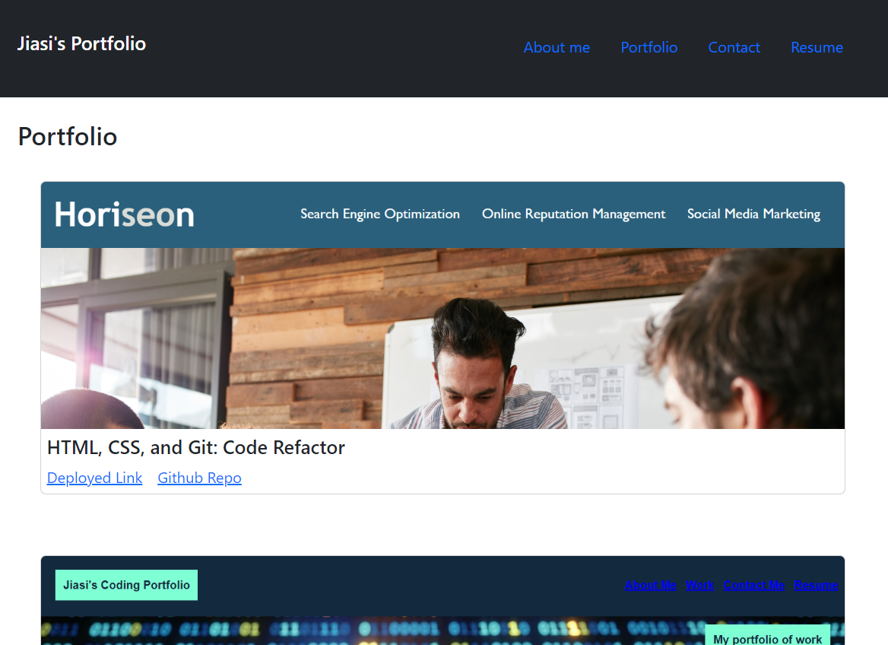
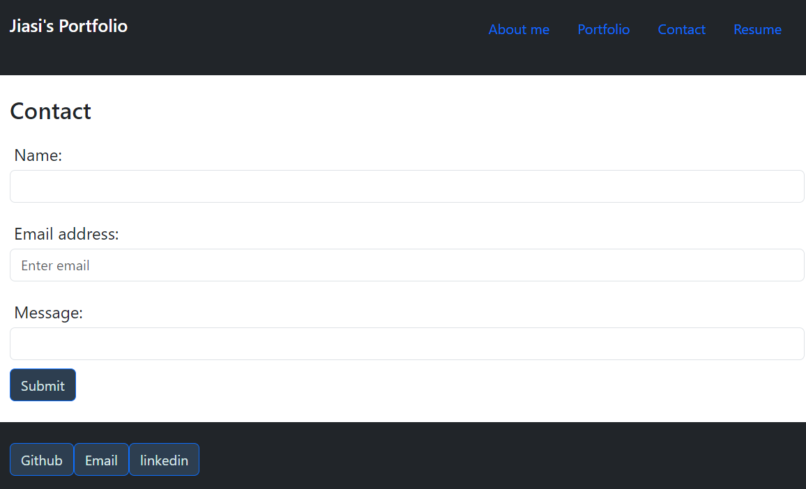
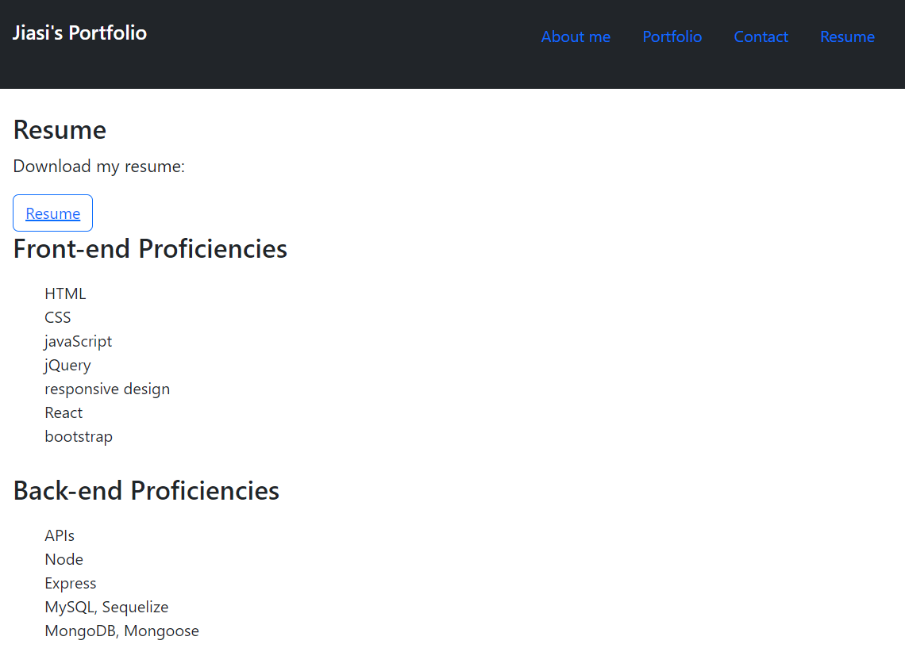

# 20 React: React Portfolio

## Description

In this challenge, My task is to create a portfolio using React skills, which will help me build the front-end of an application. 

This frond-end have four titles which are About Me, Portfolio, Contact, and Resume. In the About me page, I will show my recent photo and a small introduction. In the portfolio page, I will present six project that I have done in this boot camp with the related images, deployed links and github repo links. In the Contact page, anyone who want to contact me can leave their name, email address and messages to me. In the Resume page, visitors can download my resume by clicking the resume button, and see the list of skills that I have. 

## screenshot

## Review

* The URL of the functional, deployed application: 
https://jiasisi.github.io/React-Portfolio/

* The URL of the GitHub repository:
https://github.com/Jiasisi/React-Portfolio

